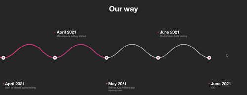

# Parallax carousel



Parallax carousel is a ease-to-use, high performance carousel that brings a new experience of using carousels just by moving cursor

## Install
`npm install parallax-carousel`

## Example usage

```html
<div id="carousel">
  <div class="my-slider">
    <div class="item">item1</div>
    <div class="item">item2</div>
    <div class="item">item3</div>
    <div class="item">item4</div>
    <div class="item">item5</div>
    <div class="item">item6</div>
  </div>
</div>
```

```js
const inst = new ParallaxCarousel({
  el: '#carousel',
});
```

## Options
```js
const inst = new ParallaxCarousel({
  el: '#app',

  // padding from right side of carousel
  user_padding: 100,

  // custom mobile detection function
  isMobileCustom() {
    return false;
  },
});
```

## License
Parallax carousel is released under the MIT license. © 2021 Miroslaw Shpak
